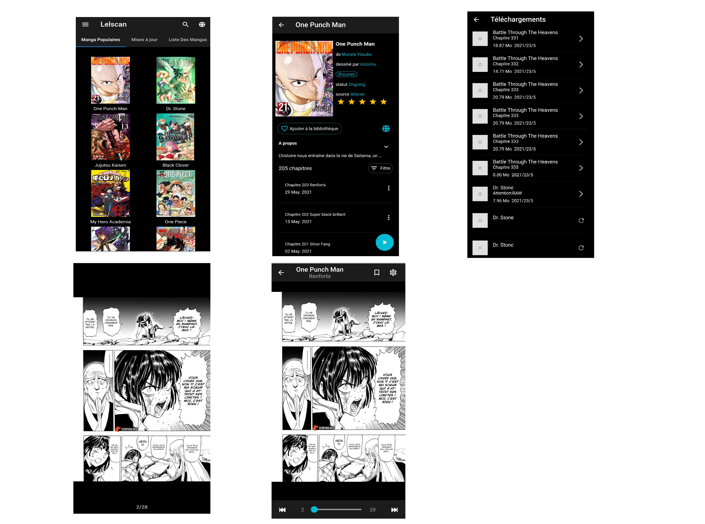

# Fanga
Fanga is a free manga reader and downloader made with Flutter for Android and ios.
The purpuse behind this project was just learning Flutter in the first place and also give a starting point for members of FlutterCM community for a flutter project with multiples functionnalities.

## Features

Features include:
* Online reading from a variety of sources(Lelscan,Readmangatoday)
* Local reading of downloaded manga
* A configurable reader with multiple viewers, reading directions and other settings.
* Light and dark themes (Feature to come)

## Download
Get the app from our [releases page](https://github.com/SherlockHolmes2045/fanga/releases).

## Disclaimer

The developer of this application does not have any affiliation with the content providers available.